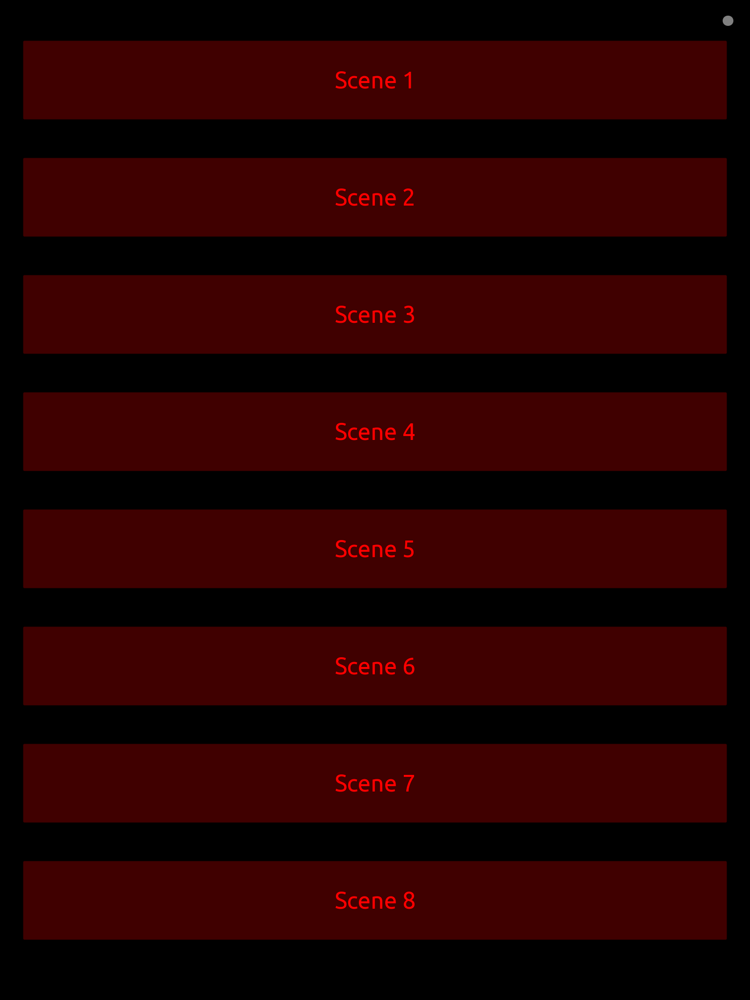
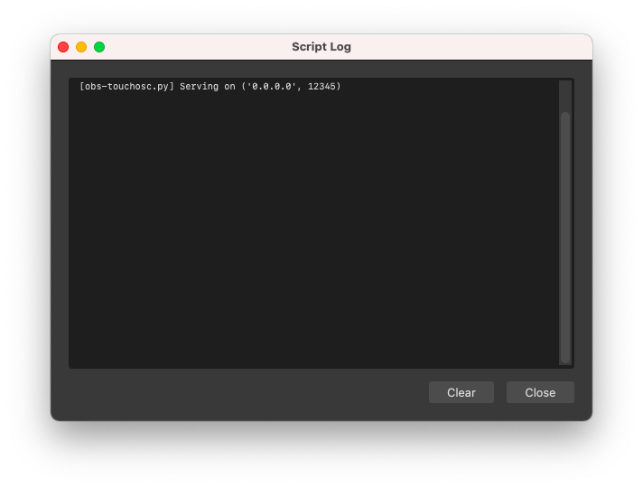

# obs-touchosc-script

OBS Studio interface for TouchOSC app.

Supports both new generation [TouchOSC app](https://hexler.net/touchosc)
and [TouchOSC Mk1](https://hexler.net/touchosc-mk1).



Comes with a very basic scene switcher control panel, and can be
extended for you own needs.

# Install

## MacOS/Linux

### Python 3.9

OBS Studio is built with Python 3.9 support, other versions won't work.

You can install it from https://www.python.org/downloads/ or you can
use your favorite package manager.

### Install the script

Clone this repository and run `./bootstrap.sh` to install required
Python libraries in a virtual environment.
```
git clone https://github.com/ishabalin/obs-touchosc-script.git

cd obs-touchosc-script

./bootstrap.sh
```

### Load the script in OBS Studio

First you need to point OBS Studio to the Python library. In the menu
select Tools -> Scripts, go to 'Python Settings' tab, and enter Python
library path in the 'Python install Path' field.

For MacOS if you installed Python from https://www.python.org/downloads/
it will be `/Library/Frameworks/Python.framework/Versions/3.9`.

For Linux -- `/usr` or `/usr/local`.


Next go to 'Scripts' tab, click plus sign and locate `obs-touchosc.py`
in the `obs-touchosc-script` directory.


Open the Script Log to verify it's launched successfully.



### Troubleshooting

If on MacOS you see this error in the log
```
socket.gaierror: [Errno 8] nodename nor servname provided, or not known
```
you may need to momentarily enable one of the Sharing services, see
https://apple.stackexchange.com/questions/253817/cannot-ping-my-local-machine.

### Connect TouchOSC app

Load the provided control panel in the TouchOSC app

- For TouchOSC use [obs-touchosc.tosc](obs-touchosc.tosc)
- For TouchOSC Mk1 use [obs-touchosc.touchosc](obs-touchosc.touchosc)

Then go to Connections -> OSC and pick 'OBS_TouchOSC' from the list.
Your computer and the iOS device running TouchOSC must be on the same
WiFi network. Fill in receive/incoming port so that the script can
talk back to TouchOSC (e.g. to update scene names).

In TouchOSC


In TouchOSC Mk1


## Windows

TBD
